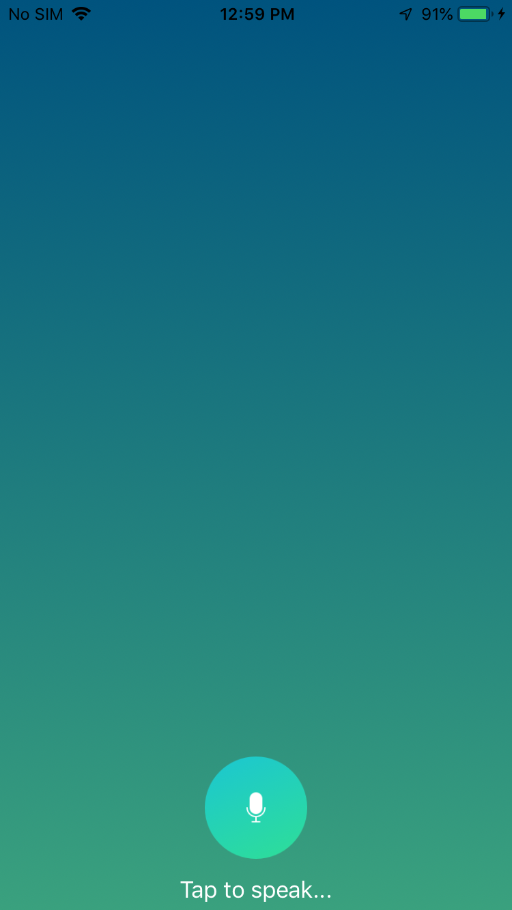
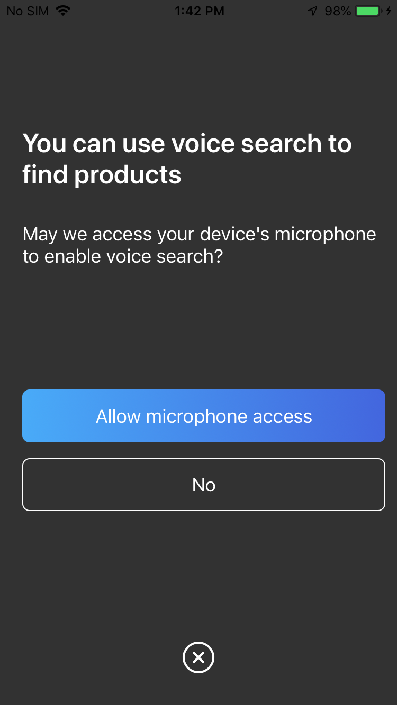
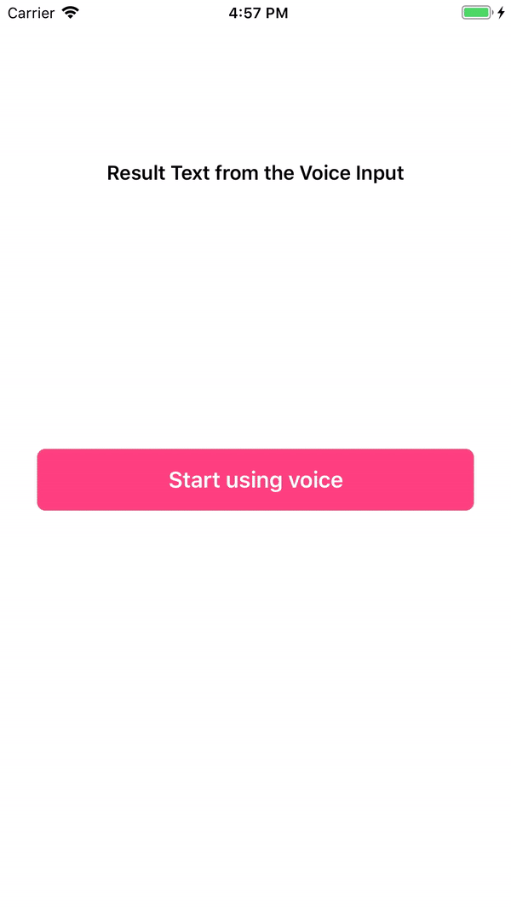

Speech Assistant
================

&nbsp;

&nbsp;

&nbsp;

A **Speech Assistant** IOS application.

## Installation

1. Checkout the source code:
2. Open the project file `SpeechToTextDemo.xcodeproj` in Xcode 8+.
4. Select an iPhone simulator and press **Run**.

The `master` branch contains latest code.
Project code based on (https://github.com/algolia/voice-overlay-ios) which turn voice into text. 
- Speech assistant app provides additional feature.
- Listen and speak.

## Usage

1. In `Info.plist`, add these 2 string properties along with the description

- `Privacy - Microphone Usage Description` with a description like: `Need the mic for audio to text`
- `Privacy - Speech Recognition Usage Description` some description like: `Need the speech recognition capabilities for searching tags`

## Permission
### Set permission on first time

&nbsp;

&nbsp;

&nbsp;

### How it handles when Permissions are missing

When there are missing permissions, the voice overlay will guide the user to the correct section of the settings app.

### Credits
This code is based on below libraries:

- algolia/voice-overlay-ios
* voice-overlay-ios
* [https://github.com/algolia/voice-overlay-ios](https://github.com/algolia/voice-overlay-ios)

